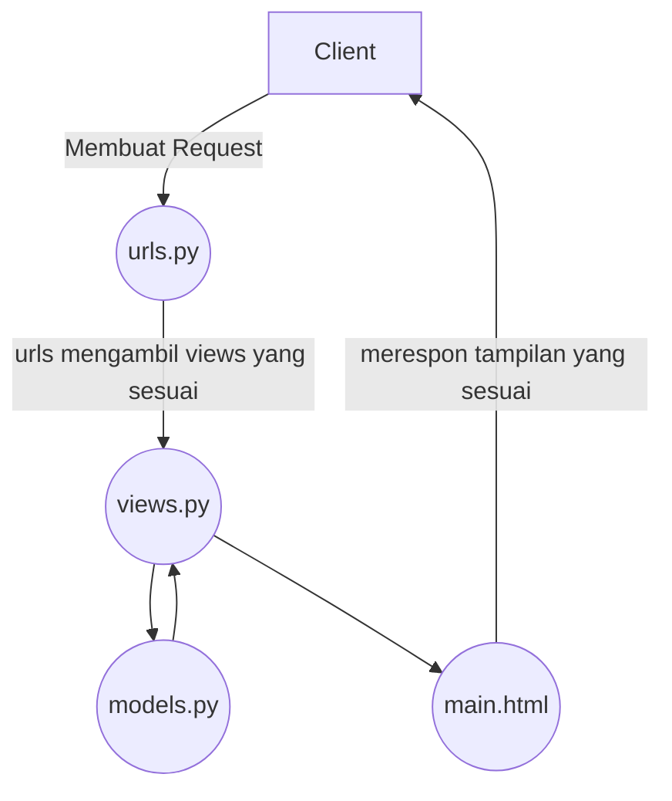

# Kepomon
[Link](https://kepomon.adaptable.app/main)

    
Tugas 3

### Apa perbedaan antara form POST dan form GET dalam Django?

POST: Saat menggunakan metode POST dalam Django (dan dalam pengembangan web umumnya), Biasa digunakan untuk mengirimkan data dari klien (dapat berupa formulir yang diisi oleh pengguna) ke server. POST merupakan metode yang lebih aman karena data dikirim dalam body HTTP, yang membuatnya tidak terlihat di URL. Form POST cocok untuk mengirim data sensitif, seperti kata sandi, dan untuk mengirim data yang akan mengubah status atau data di server, seperti menambahkan atau mengubah entri di database. Untuk membuat request POST pada django dapat dilakukan dengan request.POST.

GET: Metode GET digunakan untuk mengambil data dari server. GET dapat digunakan untuk mengirimkan parameter dalam URL ke server. Namun, data yang dikirimkan melalui metode GET terlihat di URL, sehingga kurang aman untuk data sensitif. Metode GET cocok untuk pengambilan data, pencarian, dan permintaan yang bersifat idempoten, artinya permintaan tersebut tidak akan mengubah status server atau data di dalamnya. 

Pemilihan antara metode POST dan GET tergantung pada tipe permintaan yang hendak lakukan dan keamanan data yang kirimkan atau ambil dari server.

### Apa perbedaan utama antara XML, JSON, dan HTML dalam konteks pengiriman data?
#### XML (eXtensible Markup Language):
Struktur: Menggunakan tag dan atribut untuk mendefinisikan struktur data.
Tujuan Utama: Digunakan untuk menyusun dan bertukar data dalam format yang dapat disesuaikan dengan berbagai keperluan, seperti konfigurasi, penyimpanan data, dan pertukaran data antar sistem.
Penggunaan Umum: Lebih umum digunakan dalam lingkungan yang memerlukan fleksibilitas dalam struktur data, seperti aplikasi konfigurasi dan interaksi antar sistem.
Keuntungan: Fleksibel, dapat disesuaikan, dan cocok untuk berbagai keperluan struktur data.
Keterbatasan: Sintaksis kompleks, ukuran file yang biasanya lebih besar, memerlukan lebih banyak pemrosesan.

#### JSON (JavaScript Object Notation):
Struktur: Menggunakan pasangan nama-nilai dalam objek.
Tujuan Utama: Digunakan untuk pertukaran data ringan antar server dan klien dalam format yang mudah dibaca oleh manusia dan diurai oleh mesin, terutama dalam pengembangan web.
Penggunaan Umum: Umumnya digunakan dalam pengembangan web untuk pertukaran data antar sistem, penyimpanan konfigurasi, dan berbagai keperluan struktur data.
Keuntungan: Ringan, mudah dibaca, mudah diurai, ukuran file yang lebih kecil, cocok untuk pertukaran data dalam lingkungan web.
Keterbatasan: Tidak sesuai untuk menyimpan data dengan struktur yang kompleks atau untuk keperluan lain selain pertukaran data.

#### HTML (Hypertext Markup Language):
Struktur: Menggunakan tag untuk mendefinisikan elemen dalam dokumen web.
Tujuan Utama: Digunakan untuk membuat tampilan dan struktur halaman web, termasuk teks, gambar, tautan, dan elemen-elemen lainnya.
Penggunaan Umum: Digunakan eksklusif untuk membuat halaman web dan mengorganisir konten serta interaksi pengguna di web.
Keuntungan: Cocok untuk tampilan web, dukungan browser yang kuat, dan integrasi dengan teknologi web.
Keterbatasan: Hanya cocok untuk tampilan dan interaksi web, bukan untuk pertukaran data umum atau penyimpanan struktur data.

### Mengapa JSON sering digunakan dalam pertukaran data antara aplikasi web modern?
Kombinasi dari ringan, mudah dibaca, kemampuan parsing cepat, dan dukungan yang kuat dalam ekosistem web telah membuat JSON menjadi pilihan utama untuk pertukaran data antara aplikasi web modern. JSON juga sering digunakan dalam format data API yang memungkinkan aplikasi web berkomunikasi dengan layanan web atau server backend.

### Jelaskan bagaimana cara kamu mengimplementasikan checklist di atas secara step-by-step (bukan hanya sekadar mengikuti tutorial).
Asumsikan proyek django sudah ada yang berasal dari Tugas 2.
1. Tambahkan create_item.html, base.html, dan sesuaikan templatenya agar dapat menampilkan data yang sesuai.
2. Buat forms.py agar django dapat menampilkan dan meminta user untuk mengisi form.
3. Edit views.py di main dan buat fungsi create_item yang berfungsi untuk mengakses create_item.html dan menampilkan form yang dibuat dari forms.py
4. Edit urls.py di main agar user dapat mengakses /main/create-item dengan cara memanggil fungsi create_item dari views.py
5. Edit views.py yang ada di folder kepomon dan buat 4 fungsi untuk mengambil data xml, json, xml berdasarkan id, dan json berdasarkan id.
6. Edit urls.py agar user dapat mengakses /json /xml /json/[id] /xml[id] dan memanggil fungsi yang sesuai di views.py
7. Jalankan program.

### Screenshot Postman

    
Tugas 2

### Jelaskan bagaimana cara kamu mengimplementasikan  _checklist_  di atas secara  _step-by-step_  (bukan hanya sekadar mengikuti tutorial).

1. Initialize git.
2. Buat virtual env.
3. Buat `requirements.txt` dan install menggunakan `pip install -r requirements.txt` 
4. Initialize project django baru dengan cara `django-admin-startproject`
5. Buat aplikasi baru dengan cara `python manage.py startapp`
6. Edit tampilan html pada `main.html`, serta `views.py` yang mengatur tampilan halaman web.
7. Edit `urls.py` agar tampilan web dapat diakses.
8. Edit `models.py` untuk membuat skema database yang diinginkan.
9. Jalankan `python manage.py runserver` dan seharusnya halaman web dapat diakses melalui `http://localhost:8000/main`.
10.Buat unit testing, dan lakukan testing 

### Buatlah bagan yang berisi  _request client_  ke web aplikasi berbasis Django beserta responnya dan jelaskan pada bagan tersebut kaitan antara  `urls.py`,  `views.py`,  `models.py`, dan berkas  `html`.

### Jelaskan mengapa kita menggunakan  **_virtual environment_**? Apakah kita tetap dapat membuat aplikasi web berbasis Django tanpa menggunakan  **_virtual environment_**?

virtual environment digunakan untuk mengisolasi dan mengelola dependensi proyek Python secara terpisah dari proyek yang lainnya pada komputer kita. Virtual environtment membantu mencegah konflik dan memastikan  proyek dapat di jalankan tanpa merusak proyek yang lain. Aplikasi web berbasis Django tetap dapat dibuat tanpa menggunakan virtual environtment. Jika tidak menggunakan virtual environtment, beberapa kemungkinan yang terjadi antara lain konfliknya dependensi, sistem error, environtment yang kurang bagus, serta sulitnya perbaikan.

### Jelaskan apakah itu MVC, MVT, MVVM dan perbedaan dari ketiganya.

1.  **MVC (Model-View-Controller)**:
    
    -   MVC adalah pola arsitektur perangkat lunak yang digunakan dalam pengembangan aplikasi berbasis GUI (Antarmuka Grafis Pengguna) dan web.
    -   Model: Mewakili data dan logika bisnis aplikasi.
    -   View: Bertanggung jawab untuk menampilkan informasi kepada pengguna dan mengumpulkan input dari mereka.
    -   Controller: Mengendalikan aliran informasi antara Model dan View, serta mengatur respons terhadap tindakan pengguna.
2.  **MVT (Model-View-Template)**:
    
    -   MVT adalah varian dari MVC yang digunakan dalam framework web Django, yang populer dalam pengembangan aplikasi web dengan Python.
    -   Model: Sama seperti dalam MVC, mewakili data dan logika bisnis aplikasi.
    -   View: Lebih mirip dengan Controller dalam MVC. Bertanggung jawab untuk mengatur logika pengolahan dan menghubungkan Model dan Template.
    -   Template: Menangani presentasi data dan menentukan tampilan yang akan ditampilkan kepada pengguna.
3.  **MVVM (Model-View-ViewModel)**:
    
    -   MVVM adalah pola arsitektur yang sering digunakan dalam pengembangan aplikasi berbasis GUI, terutama dalam kerangka kerja seperti Angular dan Vue.js.
    -   Model: Sama seperti dalam MVC dan MVT, mewakili data dan logika bisnis aplikasi.
    -   View: Menampilkan data dari ViewModel dan merespons tindakan pengguna.
    -   ViewModel: Berperan sebagai perantara antara Model dan View, mengonversi data Model ke bentuk yang dapat digunakan oleh View dan mengelola tindakan pengguna.

Perbedaan utama antara ketiganya adalah:

-   MVC dan MVT lebih umum digunakan dalam pengembangan web, sementara MVVM lebih sering digunakan dalam pengembangan aplikasi berbasis GUI.
-   MVT adalah varian dari MVC yang digunakan dalam Django, sedangkan MVVM adalah pola yang digunakan dalam kerangka kerja seperti Angular dan Vue.js.
-   Dalam MVC dan MVT, Controller atau View mengendalikan logika pengolahan. Sedangkan dalam MVVM, ViewModel bertanggung jawab atas sebagian besar logika pengolahan.
-   MVVM memisahkan lebih jelas antara tampilan dan logika, memungkinkan pengujian yang lebih mudah dan pengembangan berbasis komponen.

