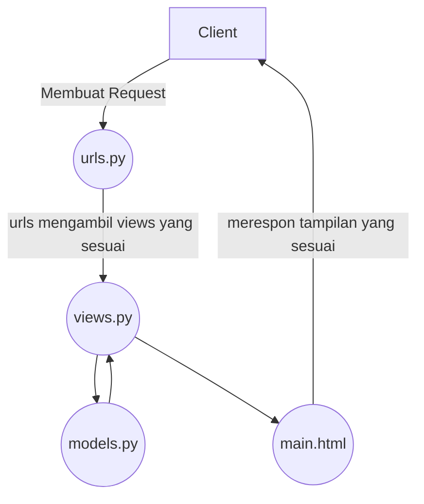

# Kepomon
[Link](https://kepomon.adaptable.app/main)

### Jelaskan bagaimana cara kamu mengimplementasikan  _checklist_  di atas secara  _step-by-step_  (bukan hanya sekadar mengikuti tutorial).

1. Initialize git.
2. Buat virtual env.
3. Buat `requirements.txt` dan install menggunakan `pip install -r requirements.txt` 
4. Initialize project django baru dengan cara `django-admin-startproject`
5. Buat aplikasi baru dengan cara `python manage.py startapp`
6. Edit tampilan html pada `main.html`, serta `views.py` yang mengatur tampilan halaman web.
7. Edit `urls.py` agar tampilan web dapat diakses.
8. Edit `models.py` untuk membuat skema database yang diinginkan.
9. Jalankan `python manage.py runserver` dan seharusnya halaman web dapat diakses melalui `http://localhost:8000/main`.
10.Buat unit testing, dan lakukan testing 

### Buatlah bagan yang berisi  _request client_  ke web aplikasi berbasis Django beserta responnya dan jelaskan pada bagan tersebut kaitan antara  `urls.py`,  `views.py`,  `models.py`, dan berkas  `html`.

### Jelaskan mengapa kita menggunakan  **_virtual environment_**? Apakah kita tetap dapat membuat aplikasi web berbasis Django tanpa menggunakan  **_virtual environment_**?

virtual environment digunakan untuk mengisolasi dan mengelola dependensi proyek Python secara terpisah dari proyek yang lainnya pada komputer kita. Virtual environtment membantu mencegah konflik dan memastikan  proyek dapat di jalankan tanpa merusak proyek yang lain. Aplikasi web berbasis Django tetap dapat dibuat tanpa menggunakan virtual environtment. Jika tidak menggunakan virtual environtment, beberapa kemungkinan yang terjadi antara lain konfliknya dependensi, sistem error, environtment yang kurang bagus, serta sulitnya perbaikan.

### Jelaskan apakah itu MVC, MVT, MVVM dan perbedaan dari ketiganya.

1.  **MVC (Model-View-Controller)**:
    
    -   MVC adalah pola arsitektur perangkat lunak yang digunakan dalam pengembangan aplikasi berbasis GUI (Antarmuka Grafis Pengguna) dan web.
    -   Model: Mewakili data dan logika bisnis aplikasi.
    -   View: Bertanggung jawab untuk menampilkan informasi kepada pengguna dan mengumpulkan input dari mereka.
    -   Controller: Mengendalikan aliran informasi antara Model dan View, serta mengatur respons terhadap tindakan pengguna.
2.  **MVT (Model-View-Template)**:
    
    -   MVT adalah varian dari MVC yang digunakan dalam framework web Django, yang populer dalam pengembangan aplikasi web dengan Python.
    -   Model: Sama seperti dalam MVC, mewakili data dan logika bisnis aplikasi.
    -   View: Lebih mirip dengan Controller dalam MVC. Bertanggung jawab untuk mengatur logika pengolahan dan menghubungkan Model dan Template.
    -   Template: Menangani presentasi data dan menentukan tampilan yang akan ditampilkan kepada pengguna.
3.  **MVVM (Model-View-ViewModel)**:
    
    -   MVVM adalah pola arsitektur yang sering digunakan dalam pengembangan aplikasi berbasis GUI, terutama dalam kerangka kerja seperti Angular dan Vue.js.
    -   Model: Sama seperti dalam MVC dan MVT, mewakili data dan logika bisnis aplikasi.
    -   View: Menampilkan data dari ViewModel dan merespons tindakan pengguna.
    -   ViewModel: Berperan sebagai perantara antara Model dan View, mengonversi data Model ke bentuk yang dapat digunakan oleh View dan mengelola tindakan pengguna.

Perbedaan utama antara ketiganya adalah:

-   MVC dan MVT lebih umum digunakan dalam pengembangan web, sementara MVVM lebih sering digunakan dalam pengembangan aplikasi berbasis GUI.
-   MVT adalah varian dari MVC yang digunakan dalam Django, sedangkan MVVM adalah pola yang digunakan dalam kerangka kerja seperti Angular dan Vue.js.
-   Dalam MVC dan MVT, Controller atau View mengendalikan logika pengolahan. Sedangkan dalam MVVM, ViewModel bertanggung jawab atas sebagian besar logika pengolahan.
-   MVVM memisahkan lebih jelas antara tampilan dan logika, memungkinkan pengujian yang lebih mudah dan pengembangan berbasis komponen.
