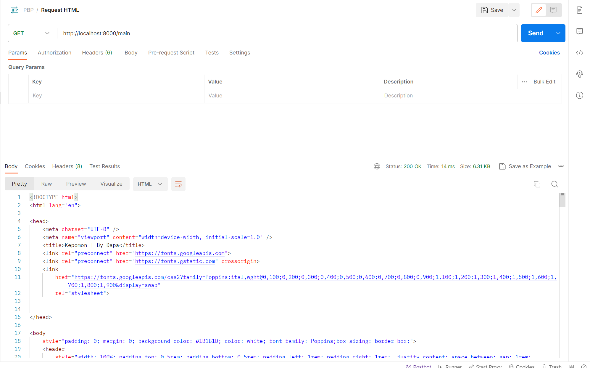

# Kepomon
[Link](https://kepomon.adaptable.app/main)

<details>
    <summary>Tugas 6 </summary>

### Jelaskan perbedaan antara asynchronous programming dengan synchronous programming.
- Synchronous Programming:
  1. Proses eksekusi perintah dilakukan secara berurutan, satu per satu.
  2. Pada saat satu perintah dieksekusi, program menunggu hingga perintah tersebut selesai sebelum melanjutkan ke perintah berikutnya.
  3. Blocking dapat terjadi, di mana eksekusi program terhenti sementara menunggu operasi yang membutuhkan waktu.
- Asynchronous Programming:
  1. Proses eksekusi perintah tidak berurutan; beberapa perintah dapat dieksekusi secara bersamaan.
  2. Program tidak perlu menunggu hasil dari suatu operasi selesai sebelum melanjutkan ke operasi berikutnya.
  3. Callbacks, promises, dan async/await adalah konsep umum yang digunakan dalam asynchronous programming untuk mengelola eksekusi non-blok.

### Dalam penerapan JavaScript dan AJAX, terdapat penerapan paradigma event-driven programming. Jelaskan maksud dari paradigma tersebut dan sebutkan salah satu contoh penerapannya pada tugas ini.
Paradigma ini berfokus pada kejadian (events) yang terjadi dalam program. Program merespon kejadian-kejadian tertentu dengan menjalankan fungsi atau blok kode yang terkait.
Salah satu penerapannya pada tugas ini adalah ketika tombol submit untuk membuat item diklik 

### Jelaskan penerapan asynchronous programming pada AJAX.

Asynchronous programming pada AJAX memungkinkan aplikasi web untuk tetap responsif saat melakukan operasi jaringan, seperti mengirim atau menerima data dari server. Dengan menggunakan Fetch API, pengembang dapat menginisiasi permintaan ke server secara asinkron, yang artinya eksekusi program tidak akan terhenti menunggu respons dari server sebelum melanjutkan eksekusi kode berikutnya.
Salah satu cara menggunakan Fetch API adalah dengan async/await

### Pada PBP kali ini, penerapan AJAX dilakukan dengan menggunakan Fetch API daripada library jQuery. Bandingkanlah kedua teknologi tersebut dan tuliskan pendapat kamu teknologi manakah yang lebih baik untuk digunakan.

- Fetch API:
  - Kelebihan:
    1. Built-in pada browser modern.
    2. Lebih ringan dan sederhana.
    3. Mendukung Promise.
  - Kekurangan:
    1. Tidak mendukung beberapa fitur kenyamanan yang dimiliki oleh jQuery.
- jQuery:
  - Kelebihan:
    1. Mudah digunakan dan memiliki sintaks yang lebih singkat.
    2. Kompatibilitas lintas browser yang baik.
    3. Memiliki banyak fungsi utilitas.
  - Kekurangan:
    1. Ukuran file yang lebih besar daripada Fetch API.
    2. Mungkin berlebihan jika hanya digunakan untuk AJAX.

Menurut saya, baik Fetch API maupun JQuery dapat melakukan perintah AJAX yang sama, JQuery membutuhkan library tambahan sehingga akan memperbesar size dari aplikasi ketika build untuk produksi. Namun JQuery dapat mempercepat development. Hal ini tentu bergantung kebutuhan, apakah development dibutuhkan dalam waktu cepat atau tidak.

### Jelaskan bagaimana cara kamu mengimplementasikan checklist di atas secara step-by-step (bukan hanya sekadar mengikuti tutorial).

Asumsikan tugas kali ini melanjutkan tugas sebelumnya.
1. Buat fungsi untuk refresh table.
2. Fungsi ini akan melakukan get content table.
3. Hasil dari get ini dirender menggunakan innerHTML.
4. Buat fungsi post untuk menambahkan barang.
5. Pastikan memanggil fungsi refresh table setelah melakukan post agar table mengupdate konten tiap menambahkan barang baru.
6. Buat fungsi hapus barang.
7. Pastikan memanggil fungsi refresh table setelah melakukan hapus barang agar table mengupdate kontent tiap menghapus barang.


</details>

<details>
    <summary>Tugas 5</summary>

### Jelaskan manfaat dari setiap element selector dan kapan waktu yang tepat untuk menggunakannya.
Element Selector memungkinkan pemilihan dan penerapan gaya pada semua elemen dengan tag tertentu pada halaman HTML. Element selector Dapat digunakan untuk memberikan styling global pada suatu jenis elemen. Element selector cocok digunakan ketika ingin menerapkan gaya yang sama pada semua elemen dengan tag tertentu. Hal ini berguna untuk mengelompokkan elemen-elemen yang serupa dan memberikan styling yang konsisten.

Contoh Penggunaan:

```css
p {
  margin: 0;
  padding: 10px;
  border: 1px solid #ccc;
}
```

Dalam contoh ini, semua elemen paragraf pada halaman akan memiliki margin nol, padding 10px, dan border 1px solid #ccc.
Penggunaan Element Selector berguna untuk mengontrol gaya pada elemen-elemen spesifik dalam halaman web secara efisien, membantu dalam menciptakan tata letak yang konsisten dan meningkatkan keterbacaan kode CSS.

### Jelaskan HTML5 Tag yang kamu ketahui.

1. \<article\>: Menunjukkan konten yang berdiri sendiri dan dapat berdiri secara independen.
2. \<section\>: Mengelompokkan konten yang serupa atau terkait.
3. \<nav\>: Menandai bagian yang berisi tautan navigasi.
4. \<header\>: Menandai bagian kepala dari suatu elemen atau halaman.
5. \<footer\>: Menandai bagian bawah dari suatu elemen atau halaman.
6. Masih banyak lainnya...

### Jelaskan perbedaan antara margin dan padding.

- Margin: Menentukan ruang di luar elemen dan berpengaruh terhadap elemen di sekitarnya.
- Padding: Menentukan ruang di dalam elemen, antara konten elemen dan batasnya.

### Jelaskan perbedaan antara framework CSS Tailwind dan Bootstrap. Kapan sebaiknya kita menggunakan Bootstrap daripada Tailwind, dan sebaliknya?

Perbedaan antara Tailwind dan Bootstrap:
- Tailwind:
  - Kelebihan: Konfigurasi yang sangat fleksibel, ukuran file yang lebih kecil karena hanya menggunakan apa yang dibutuhkan.
  - Kekurangan: Membutuhkan penulisan kelas yang lebih banyak dan bisa terlihat "berantakan".
- Bootstrap:
  - Kelebihan: Lebih mudah digunakan dengan komponen siap pakai, dokumentasi yang baik.
  - Kekurangan: Ukuran file yang mungkin lebih besar, kurangnya fleksibilitas dalam penyesuaian.

Kapan Menggunakan Bootstrap atau Tailwind?
- Bootstrap: Ketika membutuhkan cepatnya pembangunan dan memiliki desain yang relatif standar.
- Tailwind: Ketika membutuhkan kontrol yang lebih besar atas desain dan tidak keberatan menulis lebih banyak kelas.

### Jelaskan bagaimana cara kamu mengimplementasikan checklist di atas secara step-by-step (bukan hanya sekadar mengikuti tutorial).

Asumsikan pengerjaan tugas dimulai dari tugas sebelumnya:
1. Karena sudah terdapat styling sebelumnya, maka hanya perlu merapihkan stylingnya saja.
2. Kerjakan poin bonus dengan memberikan property :last-child pada tag tbody agar element terakhir memiliki style yang berbeda.


</details>

<details>
    <summary>Tugas 4</summary>

### Apa itu Django UserCreationForm, dan jelaskan apa kelebihan dan kekurangannya?

Django UserCreationForm adalah salah satu form bawaan yang disediakan oleh Django untuk membantu dalam proses pembuatan dan pendaftaran user pada sebuah aplikasi. Form ini dirancang khusus untuk membuat pengguna baru dengan username dan password

Kelebihan dari Django UserCreationForm antara lain:
1. Kemudahan Penggunaan: UserCreationForm menyederhanakan proses pembuatan akun pengguna dengan menyediakan form yang siap pakai.
2. Integrasi dengan Django Authentication: Form ini terintegrasi secara langsung dengan sistem autentikasi Django, yang membuatnya lebih mudah untuk mengelola otentikasi pengguna pada sebuah aplikasi.
3. Validasi Terintegrasi: UserCreationForm menyertakan validasi bawaan untuk memastikan bahwa data yang dimasukkan oleh pengguna memenuhi persyaratan yang ditetapkan, seperti kecocokan password, uniknya username, dan validitas alamat email jika dibutuhkan.
3. Customisasi Mudah: Djangp UserCreationForm dapat dengan mudah disesuaikan kebutuhan aplikasi yang sedang dibuat dengan menambahkan atau menghapus field form yang tersedia, atau bahkan mengubah logika validasi.

Kekurangan dari Django UserCreationForm:
1. Keterbatasan Fungsionalitas: UserCreationForm dirancang untuk tugas-tugas umum terkait pendaftaran pengguna. Jika sebuah aplikasi memerlukan informasi tambahan atau logika pendaftaran yang lebih kompleks, mungkin akan lebih baik jika dibuat dengan custom form yang dibuat sendiri.
2. Tampilan Default yang Sederhana: Form ini hanya menyediakan elemen dasar seperti teks input dan tombol. Untuk tampilan yang lebih kaya atau menarik, Untuk mengganti tampilan dari form ini butuh diberikan HTML dan CSS tambahan.
3. Ketergantungan pada Django: UserCreationForm tidak dapat digunakan diluar proyek Django.

### Apa perbedaan antara autentikasi dan otorisasi dalam konteks Django, dan mengapa keduanya penting?

Autentikasi adalah proses verifikasi identitas seseorang yang mencoba mengakses sistem atau layanan. Autentikasi memastikan bahwa pengguna yang mengakses tersebut adalah pengguna yang sesuai. Autentikasi digunakan untuk memeriksa apakah seseorang memiliki izin atau hak untuk masuk ke dalam sistem atau layanan. Contoh dari proses autentikasi adalah memasukkan kombinasi nama pengguna (username) dan kata sandi (password) saat masuk ke akun gmail. Sistem akan memeriksa apakah kombinasi username dan password yang diberikan seudah sesuai untuk pengguna mendapatkan akses ke akun tersebut.

Authorization adalah proses yang dilakukan setelah autentikasi berhasil. Authorization menentukan apa yang diizinkan atau dilarang serta menentukan tingkat akses atau hak yang dilakukan oleh pengguna yang telah teridentifikasi. Authorization menentukan apa yang diperbolehkan atau tidak diperbolehkan dilakukan oleh pengguna tersebut. Contohnya adalah setelah pengguna berhasil masuk ke akun gmail, Authorization menentukan apa yang dapat Anda lakukan, seperti membaca email pengguna tersebut, mengirim pesan, menghapus pesan, atau mengelola kontak.

### Apa itu cookies dalam konteks aplikasi web, dan bagaimana Django menggunakan cookies untuk mengelola data sesi pengguna?

Cookies adalah mekanisme penyimpanan data kecil yang dikirim oleh server web kepada browser pengguna untuk disimpan di sisi klien (pada komputer client). Cookies digunakan dalam sebuah aplikasi web untuk menyimpan informasi sederhana yang dapat digunakan kembali oleh server atau aplikasi pada kunjungan berikutnya oleh pengguna. Hal ini memungkinkan aplikasi untuk mengenali pengguna yang telah membuka suatu situs sebelumnya, menyimpan preferensi, atau mengelola sesi pengguna.

Berikut adalah bagaimana Django menggunakan cookies untuk mengelola sesi pengguna:
1. Menginisialisasi Session: Ketika pengguna pertama kali mengakses aplikasi Django, server akan membuat ID Session yang unik untuk pengguna tersebut. ID ini biasanya disimpan dalam cookie di sisi klien.
2. Menyimpan Data Sesi: Setiap kali Anda ingin menyimpan data sesi pengguna, seperti informasi login atau preferensi, Django akan menyimpan data tersebut di sisi server. Namun, data sesi ini tidak akan dikirim langsung ke klien karena merupakan data yang sensitif.
3. Mengirim Cookie: Saat merespons permintaan HTTP, server akan mengirimkan cookie dengan ID session ke browser pengguna. Cookie ini kemudian akan disimpan di sisi klien.
4. Menggunakan Cookie untuk Mengambil Data Session: Setiap kali pengguna membuat permintaan berikutnya ke aplikasi, cookie dengan ID sesi akan dikirimkan bersama permintaan tersebut. Django akan menggunakan ID sesi ini untuk mengidentifikasi pengguna dan mengambil data session yang sesuai dari penyimpanan session (biasanya disimpan di database atau dalam memori).
5. Mengubah Data Session: Saat pengguna melakukan tindakan tertentu yang mempengaruhi data session (misalnya, login atau mengubah preferensi), Django akan menyimpan data session yang diperbarui di sisi server, dan ID sesi di cookie akan tetap sama.
6. Mengakhiri Session: Saat pengguna logout atau session berakhir, Django akan menghapus data session dari penyimpanan session. GUnanya adalah agar memastikan bahwa cookie session tidak lagi valid.

### Apakah penggunaan cookies aman secara default dalam pengembangan web, atau apakah ada risiko potensial yang harus diwaspadai?

Penggunaan cookies dalam pengembangan web memiliki potensi risiko yang harus diwaspadai. Meskipun cookies adalah alat yang berguna untuk menyimpan data sederhana di sisi klien, cookies juga dapat memiliki beberapa risiko keamanan dan privasi jika tidak diatur dengan baik. Berikut adalah beberapa risiko potensial yang perlu diwaspadai:
1. Cookie Theft (Pencurian Cookie): Jika cookie yang berisi informasi sensitif seperti token otentikasi atau sesi pengguna dicuri oleh pihak yang tidak berwenang, maka pihak tersebut dapat mengakses akun pengguna tanpa izin.
2. Session Hijacking: Serangan session hijacking terjadi ketika serangkaian tindakan yang tidak sah dilakukan untuk mencuri atau memanipulasi cookie sesi pengguna untuk mendapatkan akses tidak sah.
3. Data Privacy: Cookies dapat digunakan untuk melacak perilaku pengguna secara online. Hal ini merupakan pelanggaran privasi jika tidak diatur dengan benar dan jika pengguna tidak memberikan izin yang jelas.
4. Cross-Site Scripting (XSS): Serangan XSS dapat memungkinkan penyerang untuk memasukkan kode berbahaya ke dalam cookie pengguna atau bahkan mencuri cookie pengguna melalui skrip berbahaya yang diinjeksikan ke dalam halaman web.
5. Cookie Tampering: Penyerang dapat mencoba memanipulasi cookie untuk mengganti data yang disimpan dalam cookie, seperti mengubah nilai token otentikasi.
### Jelaskan bagaimana cara kamu mengimplementasikan checklist di atas secara step-by-step (bukan hanya sekadar mengikuti tutorial).
Asumsikan proyek django dilanjutkan dari week sebelumnya :
1. Buat fungsi register pada main/views.py
2. Buat register.html untuk halaman register
3. tambahkan url untuk register pada main/urls.py
4. Lakukan hal yang sama untuk login dan logout (buat fungsi, tampilan html, dan url), kecuali logout tidak perlu tampilan html
5. Buat fungsi untuk delete item dan ubah amount. (Bonus)
6. Sesuaikan tampilan main.html untuk menjalankan fungsi delete dan ubah amount. (Bonus)
7. ubah main/urls.py agar fungsi delete dan ubah amount dapat dijalankan (Bonus).
8. Berikan retriksi untuk main.html, ubah amount, dan delete agar mengharuskan user untuk login sebelum mengakses fungsi tersebut.
9. Sesuaikan fungsi login, register, dan logout untuk mengatur cookies.
10. Ubah models Item agar item memiliki relasi many to one dengan User.
11. Sesuaikan kembali fungsi show_main agar Item yang ditampilkan hanya item yang dibuat oleh user yang sedang login saat itu.

</details>

<details>
    <summary>Tugas 3</summary>
    
### Apa perbedaan antara form POST dan form GET dalam Django?

POST: Saat menggunakan metode POST dalam Django (dan dalam pengembangan web umumnya), Biasa digunakan untuk mengirimkan data dari klien (dapat berupa formulir yang diisi oleh pengguna) ke server. POST merupakan metode yang lebih aman karena data dikirim dalam body HTTP, yang membuatnya tidak terlihat di URL. Form POST cocok untuk mengirim data sensitif, seperti kata sandi, dan untuk mengirim data yang akan mengubah status atau data di server, seperti menambahkan atau mengubah entri di database. Untuk membuat request POST pada django dapat dilakukan dengan request.POST.

GET: Metode GET digunakan untuk mengambil data dari server. GET dapat digunakan untuk mengirimkan parameter dalam URL ke server. Namun, data yang dikirimkan melalui metode GET terlihat di URL, sehingga kurang aman untuk data sensitif. Metode GET cocok untuk pengambilan data, pencarian, dan permintaan yang bersifat idempoten, artinya permintaan tersebut tidak akan mengubah status server atau data di dalamnya. 

Pemilihan antara metode POST dan GET tergantung pada tipe permintaan yang hendak lakukan dan keamanan data yang kirimkan atau ambil dari server.


### Apa perbedaan utama antara XML, JSON, dan HTML dalam konteks pengiriman data?
#### XML (eXtensible Markup Language):
Struktur: Menggunakan tag dan atribut untuk mendefinisikan struktur data.
Tujuan Utama: Digunakan untuk menyusun dan bertukar data dalam format yang dapat disesuaikan dengan berbagai keperluan, seperti konfigurasi, penyimpanan data, dan pertukaran data antar sistem.
Penggunaan Umum: Lebih umum digunakan dalam lingkungan yang memerlukan fleksibilitas dalam struktur data, seperti aplikasi konfigurasi dan interaksi antar sistem.
Keuntungan: Fleksibel, dapat disesuaikan, dan cocok untuk berbagai keperluan struktur data.
Keterbatasan: Sintaksis kompleks, ukuran file yang biasanya lebih besar, memerlukan lebih banyak pemrosesan.

#### JSON (JavaScript Object Notation):
Struktur: Menggunakan pasangan nama-nilai dalam objek.
Tujuan Utama: Digunakan untuk pertukaran data ringan antar server dan klien dalam format yang mudah dibaca oleh manusia dan diurai oleh mesin, terutama dalam pengembangan web.
Penggunaan Umum: Umumnya digunakan dalam pengembangan web untuk pertukaran data antar sistem, penyimpanan konfigurasi, dan berbagai keperluan struktur data.
Keuntungan: Ringan, mudah dibaca, mudah diurai, ukuran file yang lebih kecil, cocok untuk pertukaran data dalam lingkungan web.
Keterbatasan: Tidak sesuai untuk menyimpan data dengan struktur yang kompleks atau untuk keperluan lain selain pertukaran data.

#### HTML (Hypertext Markup Language):
Struktur: Menggunakan tag untuk mendefinisikan elemen dalam dokumen web.
Tujuan Utama: Digunakan untuk membuat tampilan dan struktur halaman web, termasuk teks, gambar, tautan, dan elemen-elemen lainnya.
Penggunaan Umum: Digunakan eksklusif untuk membuat halaman web dan mengorganisir konten serta interaksi pengguna di web.
Keuntungan: Cocok untuk tampilan web, dukungan browser yang kuat, dan integrasi dengan teknologi web.
Keterbatasan: Hanya cocok untuk tampilan dan interaksi web, bukan untuk pertukaran data umum atau penyimpanan struktur data.

### Mengapa JSON sering digunakan dalam pertukaran data antara aplikasi web modern?
Kombinasi dari ringan, mudah dibaca, kemampuan parsing cepat, dan dukungan yang kuat dalam ekosistem web telah membuat JSON menjadi pilihan utama untuk pertukaran data antara aplikasi web modern. JSON juga sering digunakan dalam format data API yang memungkinkan aplikasi web berkomunikasi dengan layanan web atau server backend.

### Jelaskan bagaimana cara kamu mengimplementasikan checklist di atas secara step-by-step (bukan hanya sekadar mengikuti tutorial).
Asumsikan proyek django sudah ada yang berasal dari Tugas 2.
1. Tambahkan create_item.html, base.html, dan sesuaikan templatenya agar dapat menampilkan data yang sesuai.
2. Buat forms.py agar django dapat menampilkan dan meminta user untuk mengisi form.
3. Edit views.py di main dan buat fungsi create_item yang berfungsi untuk mengakses create_item.html dan menampilkan form yang dibuat dari forms.py
4. Edit urls.py di main agar user dapat mengakses /main/create-item dengan cara memanggil fungsi create_item dari views.py
5. Edit views.py yang ada di folder kepomon dan buat 4 fungsi untuk mengambil data xml, json, xml berdasarkan id, dan json berdasarkan id.
6. Edit urls.py agar user dapat mengakses /json /xml /json/[id] /xml[id] dan memanggil fungsi yang sesuai di views.py
7. Jalankan program.

### Screenshot Postman



</details>

<details>
    <summary>Tugas 2</summary>
### Jelaskan bagaimana cara kamu mengimplementasikan  _checklist_  di atas secara  _step-by-step_  (bukan hanya sekadar mengikuti tutorial).

1. Initialize git.
2. Buat virtual env.
3. Buat `requirements.txt` dan install menggunakan `pip install -r requirements.txt` 
4. Initialize project django baru dengan cara `django-admin-startproject`
5. Buat aplikasi baru dengan cara `python manage.py startapp`
6. Edit tampilan html pada `main.html`, serta `views.py` yang mengatur tampilan halaman web.
7. Edit `urls.py` agar tampilan web dapat diakses.
8. Edit `models.py` untuk membuat skema database yang diinginkan.
9. Jalankan `python manage.py runserver` dan seharusnya halaman web dapat diakses melalui `http://localhost:8000/main`.
10.Buat unit testing, dan lakukan testing 

### Buatlah bagan yang berisi  _request client_  ke web aplikasi berbasis Django beserta responnya dan jelaskan pada bagan tersebut kaitan antara  `urls.py`,  `views.py`,  `models.py`, dan berkas  `html`.


### Jelaskan mengapa kita menggunakan  **_virtual environment_**? Apakah kita tetap dapat membuat aplikasi web berbasis Django tanpa menggunakan  **_virtual environment_**?

virtual environment digunakan untuk mengisolasi dan mengelola dependensi proyek Python secara terpisah dari proyek yang lainnya pada komputer kita. Virtual environtment membantu mencegah konflik dan memastikan  proyek dapat di jalankan tanpa merusak proyek yang lain. Aplikasi web berbasis Django tetap dapat dibuat tanpa menggunakan virtual environtment. Jika tidak menggunakan virtual environtment, beberapa kemungkinan yang terjadi antara lain konfliknya dependensi, sistem error, environtment yang kurang bagus, serta sulitnya perbaikan.

### Jelaskan apakah itu MVC, MVT, MVVM dan perbedaan dari ketiganya.

1.  **MVC (Model-View-Controller)**:
    
    -   MVC adalah pola arsitektur perangkat lunak yang digunakan dalam pengembangan aplikasi berbasis GUI (Antarmuka Grafis Pengguna) dan web.
    -   Model: Mewakili data dan logika bisnis aplikasi.
    -   View: Bertanggung jawab untuk menampilkan informasi kepada pengguna dan mengumpulkan input dari mereka.
    -   Controller: Mengendalikan aliran informasi antara Model dan View, serta mengatur respons terhadap tindakan pengguna.
2.  **MVT (Model-View-Template)**:
    
    -   MVT adalah varian dari MVC yang digunakan dalam framework web Django, yang populer dalam pengembangan aplikasi web dengan Python.
    -   Model: Sama seperti dalam MVC, mewakili data dan logika bisnis aplikasi.
    -   View: Lebih mirip dengan Controller dalam MVC. Bertanggung jawab untuk mengatur logika pengolahan dan menghubungkan Model dan Template.
    -   Template: Menangani presentasi data dan menentukan tampilan yang akan ditampilkan kepada pengguna.
3.  **MVVM (Model-View-ViewModel)**:
    
    -   MVVM adalah pola arsitektur yang sering digunakan dalam pengembangan aplikasi berbasis GUI, terutama dalam kerangka kerja seperti Angular dan Vue.js.
    -   Model: Sama seperti dalam MVC dan MVT, mewakili data dan logika bisnis aplikasi.
    -   View: Menampilkan data dari ViewModel dan merespons tindakan pengguna.
    -   ViewModel: Berperan sebagai perantara antara Model dan View, mengonversi data Model ke bentuk yang dapat digunakan oleh View dan mengelola tindakan pengguna.

Perbedaan utama antara ketiganya adalah:

-   MVC dan MVT lebih umum digunakan dalam pengembangan web, sementara MVVM lebih sering digunakan dalam pengembangan aplikasi berbasis GUI.
-   MVT adalah varian dari MVC yang digunakan dalam Django, sedangkan MVVM adalah pola yang digunakan dalam kerangka kerja seperti Angular dan Vue.js.
-   Dalam MVC dan MVT, Controller atau View mengendalikan logika pengolahan. Sedangkan dalam MVVM, ViewModel bertanggung jawab atas sebagian besar logika pengolahan.
-   MVVM memisahkan lebih jelas antara tampilan dan logika, memungkinkan pengujian yang lebih mudah dan pengembangan berbasis komponen.
</details>
